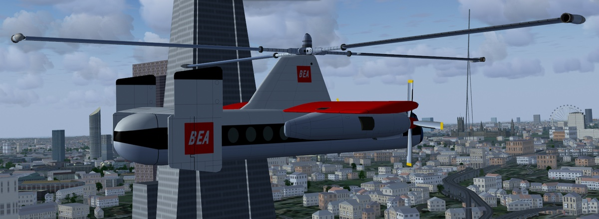

# Fairey Rotodyne
### AI Aircraft for FlightGear
(Work In Progress)

Download the zip file and extract the "rotodyne" folder into the "$FG_ROOT/AI/Aircraft" folder.

To use you will need to create a traffic file, see the wiki for instructions.
 http://wiki.flightgear.org/AI_Traffic

There is a simple AI Traffic Creator here: 
https://github.com/gooneybird47/FlightGear-AI-Traffic-Creator

At the moment this model is probably best used in a scenario rather than as normal AI traffic.